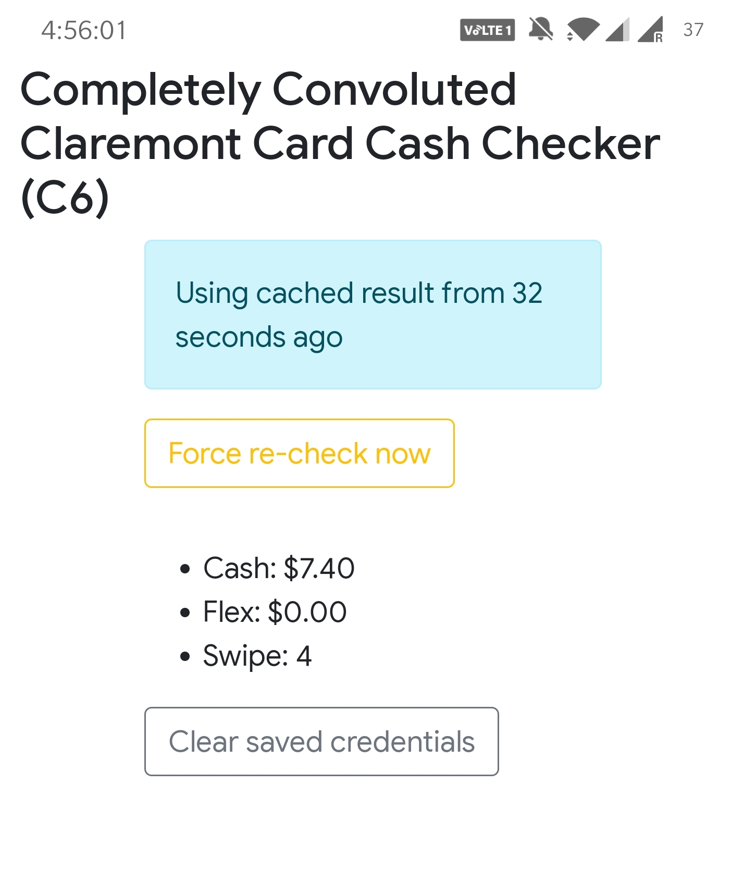

# Completely Convoluted Claremont Card Cash Checker

Web app available at [https://c6.mia.wang](https://c6.mia.wang). This app conforms to the 
Progressive Web App (PWA) requirement and can be installed as a standalone app by the 
respective browser. 

# Rationale 

The current system for checking flex and cash is outdated and has serious security flaws
(for one thing, when you try to reset the password they email you your password in plain
text). Moreover, they require cumbersome login flows which takes a long time to complete.
Lastly, they display the legal name (instead of campus name) of the user in big font on 
the first page, which can hurt people who go by a different name (such as some members 
of the queer community) than what they use in day-to-day life and would rather not being
reminded of their legal name whenever possible.  

This web app solves all the issues above by creating a easy-to-use interface that does not
display any unnecessary information.
